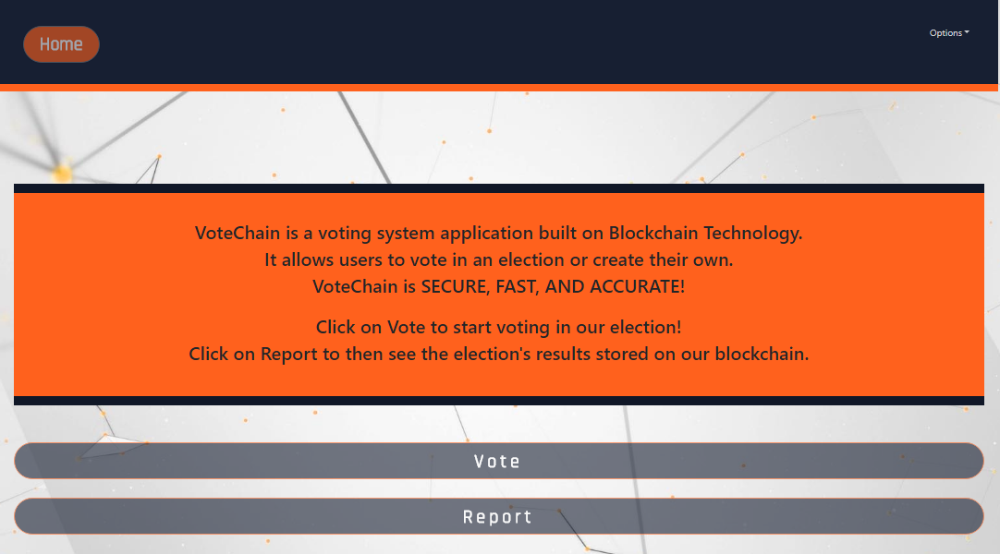

# VoteChain
VoteChain is a web app that uses blockchain technology to try and emulate what a real online election could be like. VoteChain can be used for businesses or even scale up to U.S. elections! Users are even able to vote from anywhere including their phones. VoteChain uses blockchains to ensure that votes are immutable and verified. As an added security measure, only users from a premade data set will be able to register so that only the people we want to vote will be able to do so.

## Web Link
https://vote-chain.herokuapp.com/

Login credentials for guests: 
* Email: guest@votechain.com
* Password: votechain

## Table of Contents
* [How Blockchains Work](#how-blockchains-work)
* [How To Use VoteChain](#how-to-use-votechain)
* [Register & Login](#register-&-login)
* [Vote](#vote)
* [Report](#report)
* [Options](#options)
* [Technologies Used](#technologies-used)

## How Blockchains Work
A Blockchain contains many blocks. Each block contains information and in VoteChain's case, they each contain one vote. Every block has a unique hash that is created upon the creation of the block. The blocks are created in order so that a newer block will reference a previous block's hash. This causes the blockchain to be immutable meaning that the votes in VoteChain can never be changed or removed. For an online voting system to work, blockchains are integral to insure secure and verified votes. There are currently very few verified online voting systems that exist today.

# How To Use VoteChain

## Register & Login

1. Users will land on the landing page.
2. If you are not already registerd, then click on the `Registration` button and fill out the boxes with their required information.
	* Only users that are in the premade data set will be able to register

3. Once successfully registered or if you are already registered, enter your **username** and **password** on the landing page. Then click the `Login` button to login.

4. You will be redirected to the home page if successful.

5. Once at the home page, click on the `Vote` or `Report` button to see their respective pages. The vote page contains an election in which you can vote on your favorite project from the UT Coding Bootcamp. The report page shows VoteChains blockchain information. This is to show that the blockchain works.

## Vote

1. Click on the `Select` button underneath your favorite UT Coding Bootcamp project to vote for it.
2. Click on the `Submit` button at the bottom of the page to submit your bote.

## Results

1. On this page the current election's blockchain's information is shown.
2. Each user will have a public key which is used to identify yourself in the blockchain. Just find a key under voter that is the same as your public key to find your vote in the blockchain.
3. Each block in the blockchain references the previous block which cause the blockchain to be immutable.

## Options
1. The `Options` menu in the top right of the page contains a few options.

2. Clicking on `Github` will redirect you to VoteChain's Github repository which contains all the code used in the project for others to see.
3. Clicking on `Developers` will show the developers page which contains all of the people who were involved in the making of VoteChain. Their Githubs and LinkIns are also included so be sure to check them out.

4. `Logout` will only be shown if a user is logged in. Clicking on it will logout the user.

## Technologies Used
* Javascript
* React
* MongoDB
* Express
* Sessions
* Blockchain
* MVC Architecture
* Bootstrap
* HTML
* CSS